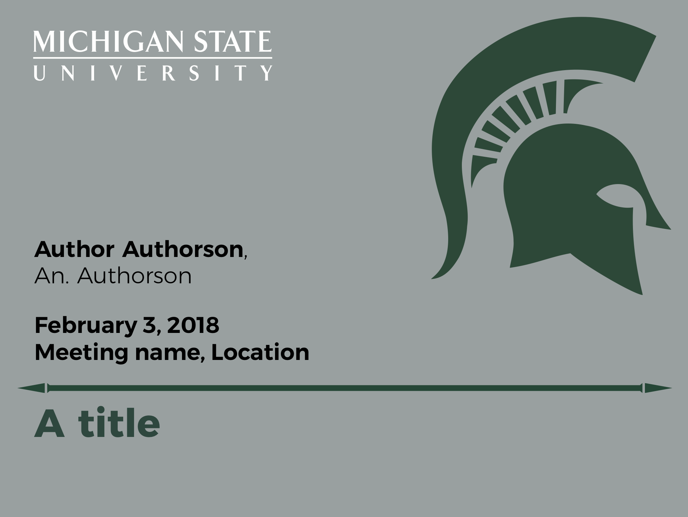
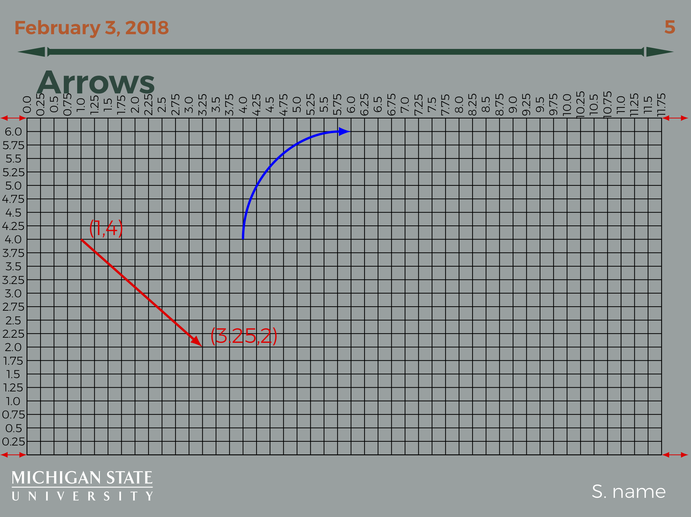
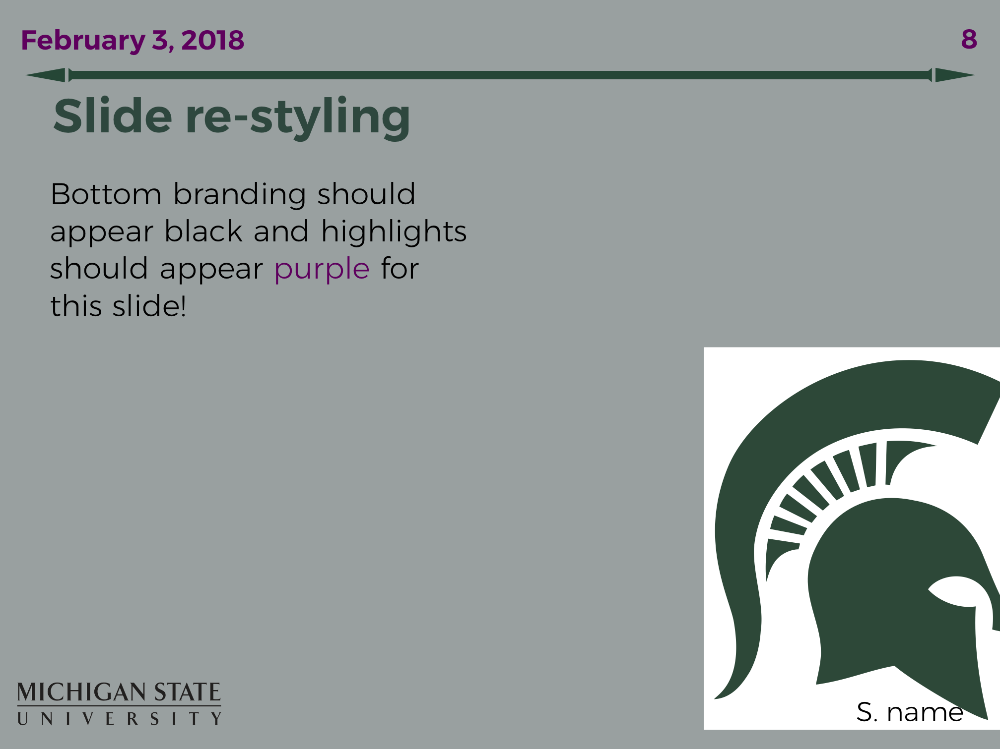

# MSU_Light Beamer theme

## What is it?

Simple TiKz-based beamer theme to write latex slides
with a distincly MSU color and logo theme. Includes
some helpful TikZ macros for text areas, image insertion
and arrow drawing.

## Installing

You can install to your local texemf area by executing [install.sh](./install.sh)

## An example

Include in your beamer project with `\usetheme{MSU_Light}`.
For a more detailed tutorial, see the [example](./slides.template.tex)
and the [render](./slides.template.pdf).

